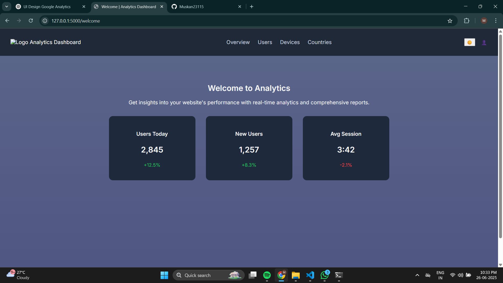
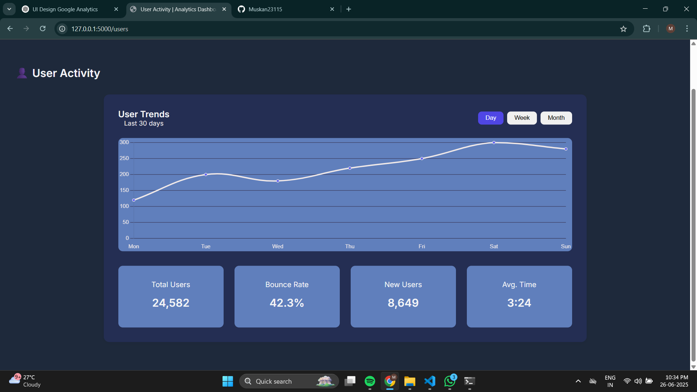
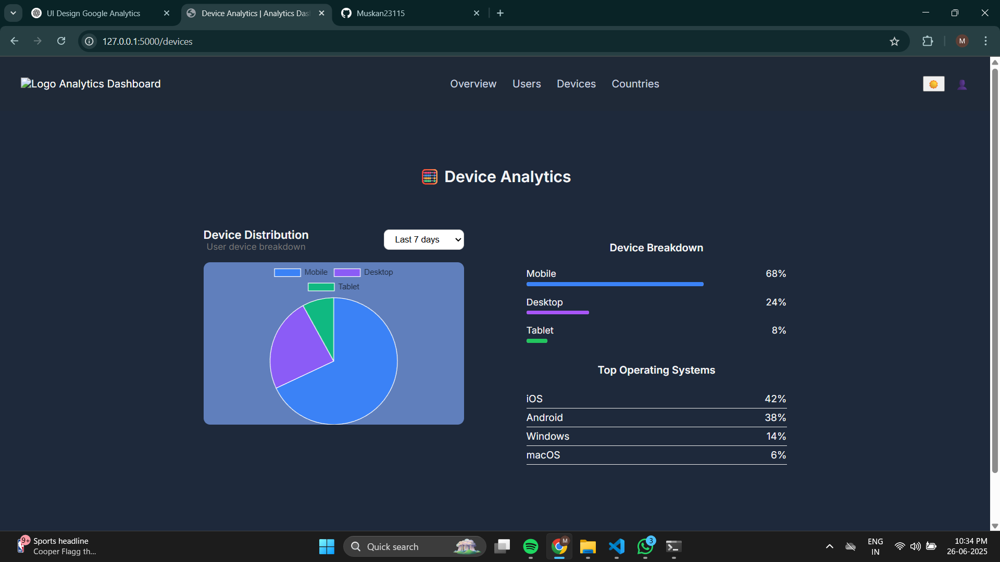
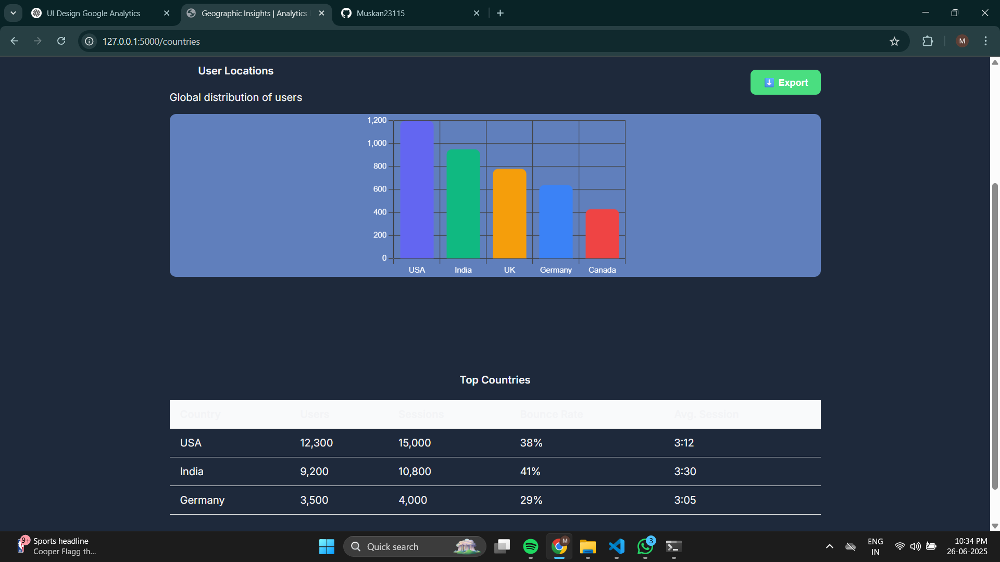

# 📊 Google Analytics Dashboard

This project is a modernGoogle Analytics Dashboard built using **Flask**, **Chart.js**, and **Google Analytics Data API (GA4)**. It visualizes real-time user metrics including active users, device distribution, and country-wise traffic with a clean and responsive UI.

---

## 🔍 Features

- ✅ Real-time GA4 data integration (Active Users, Devices, Countries)
- ✅ Clean, modern UI designed using Canva
- ✅ Smooth vertical scrolling layout with full-screen sections
- ✅ Dark/Light theme toggle
- ✅ Chart.js-powered visualizations
- ✅ Flask-powered backend with modular JavaScript files

---

## 📸 Dashboard Preview

| Dashboard | Users | Devices | Countries |
|----------|-------|---------|-----------|
|  |  |  |  |

## 🚀 Getting Started

### 1. Clone the Repository

```bash
git clone https://github.com/yourusername/analytics-dashboard.git
cd analytics-dashboard
````

### 2. Set Up a Virtual Environment

```bash
python -m venv env
source env/bin/activate  # On Windows: env\Scripts\activate
```

### 3. Install Dependencies

```bash
pip install -r requirements.txt
```

### 4. Add Google Analytics Credentials

* Create a GA4 property and enable the **Google Analytics Data API**
* Download the `your_credentials.json` file
* Place it in the root directory
* **Important**: Do NOT push this file to GitHub

### 5. Run the Flask App

```bash
flask run
```

Visit: [http://127.0.0.1:5000](http://127.0.0.1:5000)

---

## 📂 Project Structure

```
analytics-dashboard/
│
├── static/
│   ├── css/
│   ├── js/
│   │   ├── users.js
│   │   ├── devices.js
│   │   ├── countries.js
│   └── images/
│       ├── dashboard.png
│       ├── users.png
│       ├── devices.png
│       └── countries.png
│
├── templates/
│   ├── base.html
│   ├── welcome.html
│   ├── users.html
│   ├── devices.html
│   └── countries.html
│
├── your_credentials.json  # (should be ignored in .gitignore)
├── app.py
├── .gitignore
└── README.md
```

---

## 🔐 Important

Add `your_credentials.json` to `.gitignore` to protect your sensitive keys:

```
your_credentials.json
.env
__pycache__/
*.pyc
```

---

## 🙋‍♀️ Developed By

**Muskan**
Web Development Intern · Arya College of Engineering

---


